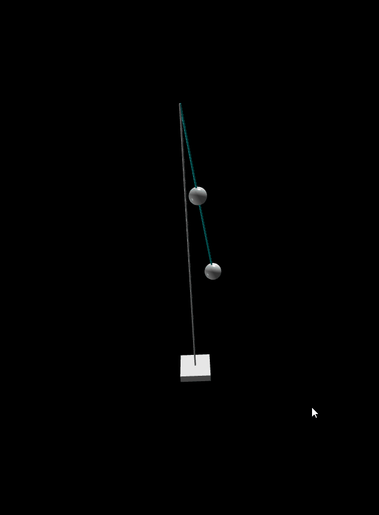

# Dvostruko Sferno Klatno

Seminarski iz kursa Osnovi mehanike. 

Zadatak je bio implementirati dvostruko sferno klatno u pythonu. Pored toga smo se bavili i paralelizacijom programa i prakticno videli koliku dobit ova tehnika donosi
kada su u pitanju intenzivnija izracunavanja poput ovog. 

Animirano uz pomoc vpythona. Pre pokretanja instalirati paket sa komandom:

`pip install vpython`

### Demo

